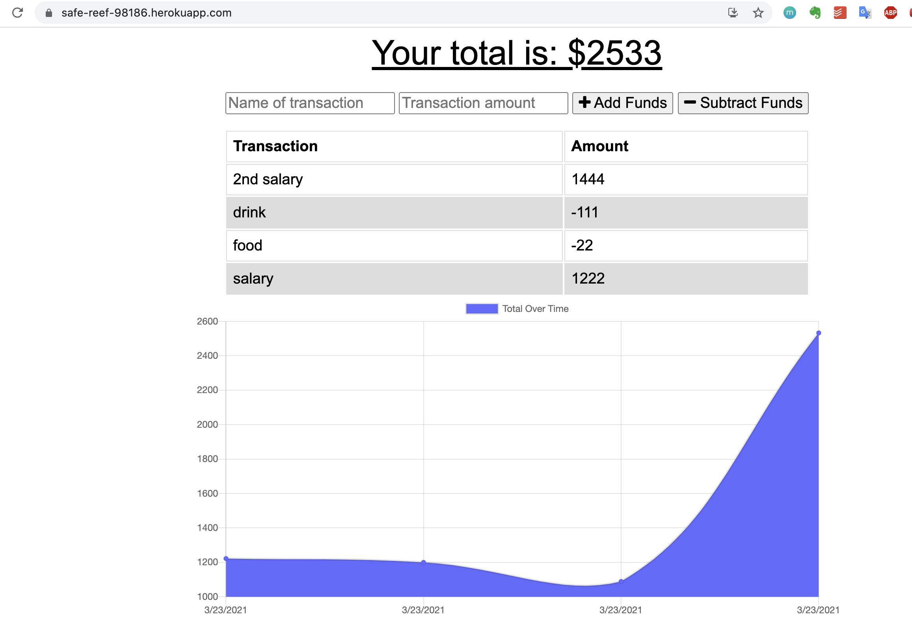

# Unit 18 PWA Homework: Online/Offline Budget Trackers

* Add functionality to our existing Budget Tracker application to allow for offline access and functionality.

The user will be able to add expenses and deposits to their budget with or without a connection. When entering transactions offline, they should populate the total when brought back online.

Offline Functionality:

  * Enter deposits offline

  * Enter expenses offline

When brought back online:

  * Offline entries should be added to tracker.

## Table of Contents
* [Screenshots](#Screenshots)
* [Installation](#Installation)
* [Technologies](#Technologies)
* [Repository](#Repository)
* [Deployment](#Deployment)

## Screenshots
* [App](#public/assets/app.png)
* [Manifest Page](#public/assets/manifest.png)
* [Static Cache](#public/assets/cache1.png)
* [Data Cache](#public/assets/cache2.png)

#### Application Page
The screenshot of the application.

  

#### Manifest Page
The screenshot of the manifest page.

  

#### Static Cache
The screenshot of the Static Cache.

  

#### Data Cache
The screenshot of the DataCache.

  

## Installation

* Install node.js to computer follow instructions from  [here](https://nodejs.org/en/)
* Copy all the application files locally to one's machine.
* Install 'mongoose', 'morgan', 'express' npm package by running 

    * **npm install**

* Run the application by the following instructions in the terminal

    * **node server.js**

The application will be listened on localhost:3030 in your browser URL line.

## Technologies

* Mongoose
* Express
* Node.js
* Heroku
* morgan

## Repository

The link to the github repository is: https://github.com/lhaodev/fitness_tracker 

## Deployment

The link to the deployed application is: https://fast-mesa-62687.herokuapp.com/